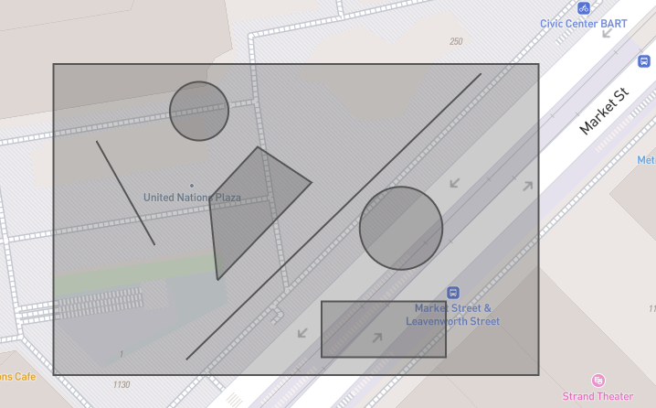

# GeoImageDraw
An efficient and lightweight library which is used to draw geojson geometry in tile image 


Introduction
--
Various open-source libraries such as [folium](https://github.com/python-visualization/folium) are available for geospatial data visualization on the map.
Users can also retrieve tile images via API (e.g. [smopy](https://github.com/rossant/smopy)). This is not suitable for geospatial computer vision applications where you like to
plot millions of images based on geojson data efficiently since those libraries depend on 3rd-party services and retrieving a large number of images from remote sites usually becomes a bottlneck. In this repository we like to develop a lightweight library which can efficiently convert geojson objects to images which's format is compatible with that in open-street map tile image.

Usage
--
For the ease of usage, one utility function is used to plot geo shapes in geojson feature collections to retrieve pillow image.

```
from GeoImageDraw import GeoDraw
import json

geojson_feature_collection = json.loads(geojson_data_str)
pillow_image = GeoDraw.generate_image_from_geojson(geojson_feature_collection, 
                                                   z=19,
                                                   lnglatbox=None,
                                                   maxtiles=32,
                                                   backgroundColor=0,
                                                   foregroundColor='#ffffff')
"""
Draw geometries in geojson collections and return pillow image
color can be specified in properties with key name 'color' 
(e.g. "properties": {"color": "#065535"}
if color is not in the properties, the foregroundColor will be used
lnglatbox: (lon_min, lat_min, lon_max, lat_max). If this value is None, bounded box
will be calculated based on geometries within feature collection.
"""

```

The example folder provides a script to show the usage.  data.geojson is saved in geojson.io from .

The output image from GeoImageDraw is .

Speed benchmark
--
The dataset with 25000 geojson feature collections are tested. The average number of points per feature collection is 137. The throughput is 541 images per second.


Credit
--
This library leverages the codes in [smopy](https://github.com/rossant/smopy) where geographical coordinates are converted to tile pixel coordinates.
Good credit goes to [Cyrille Rossant](https://github.com/rossant).
